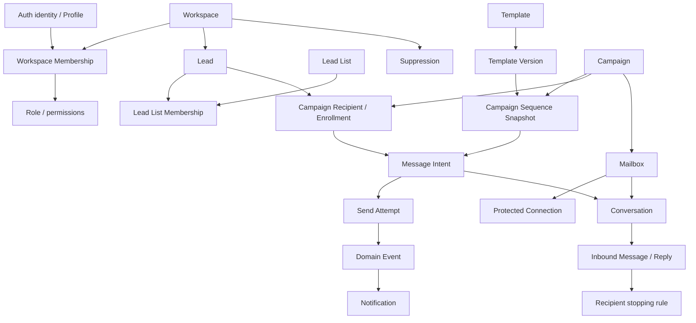

# Domain Model

## Purpose and authority

This is the conceptual model for the MVP, derived from [PROJECT_CONTEXT](../product/PROJECT_CONTEXT.md), [MVP](../product/MVP.md), [PAGE_MAP](../product/PAGE_MAP.md), and [SYSTEM_ARCHITECTURE](SYSTEM_ARCHITECTURE.md). It defines business ownership, not SQL. Detailed technical rules below are the design produced by this documentation phase; they are not claims of prior approval. Explicit Open Decisions require owner resolution before dependent implementation.

**Source discrepancy:** `docs/product/USER_ROLES.md` actually contains the complete “User Flows” specification (UF-01–UF-37) and expressly defers role permissions. `USER_FLOWS.md` is absent. References to [existing flows](../product/USER_ROLES.md) mean that content, not a permission matrix. No role-to-permission grants can be inferred from its filename. Preserve it pending product-document repair.

## Domain map

Every workspace aggregate belongs to exactly one workspace; references never transfer tenancy. Opaque IDs identify resources but grant no access. Backend application services own domain mutations; workers call those services. PostgreSQL persists authoritative entities, versions, transitions and work intent. Redis holds transport and temporary coordination only.

## Entity catalogue

The lifecycle and deletion rules here are design defaults where product documents leave details open. Retention durations and any destructive product workflow remain subject to the Open Decisions below.

| Entity / owning subsystem | Purpose, identity and workspace | Lifecycle and relationships | Invariants; mutable data; deletion |
|---|---|---|---|
| User / Profile — users | Supabase Auth owns authentication identity; profile ID equals auth subject. Identity is global, not owned by one workspace. | Identity may have several memberships; profile contains display preferences, not workspace authority. | Never duplicate passwords. Profile edits cannot change auth subject. Account erasure coordinates memberships and historical actor references rather than cascading sending history. |
| Workspace — workspaces | Tenant root with opaque workspace ID. | Active → restricted → active; deletion pending is a separate controlled operation. Contains all customer domains. | Name/defaults mutable; ID immutable. Restriction gates sending independently of campaign status. No ordinary hard delete until retention and ownership policy approved. |
| Membership — workspaces | Stable membership ID plus workspace and user IDs. | Active or revoked; invitation acceptance creates/reactivates membership through an authorized command. | At most one relationship per workspace/user. Role changes versioned and audited; removed access fails next authoritative operation. Never derive current membership from cached JWT role claims. |
| Role / Permission — authorization | Expected roles: Owner, Admin, Manager, Member, Viewer. Permissions are action capabilities evaluated in workspace context. | Role assignment belongs to membership, not profile. Platform operators have separate authority. | No arbitrary client-selected grants. Exact grants, ownership cardinality and transfer/removal permissions are missing product decisions. Undefined permission denies. |
| Workspace Invitation — workspaces | Workspace, invite ID, intended identity and role. Supports the existing team flow. | Pending → accepted / expired / revoked; resend replaces token validity. | Single-use token stored as digest, expiry enforced. Acceptance binds authenticated identity, role and membership atomically. No token in logs. |
| Lead — leads | Reusable workspace contact; lead ID and normalized email identity. | Active or archived; invalid/suppressed/replied indicators are distinct facts, not one overloaded status. | Contact fields mutable; identity edits cannot rewrite existing enrollment addresses. Lists and campaigns reference a lead rather than making copies. Archive prevents new execution; historical evidence retained. |
| Lead List / Membership — lists | Reusable collection and unique list/lead relationship within workspace. | List rename/archive; membership added/removed. | Removing list membership does not delete lead or silently alter an activated audience. No safety override. Membership itself can be removed; used audience snapshots survive. |
| Suppression — suppression | Prohibition keyed by workspace + normalized address + reason; platform blocks separately scoped. Lead may not exist. | Active → released only by permitted reason-specific command. | Multiple reasons coexist. Imports, list edits, lead deletion and template changes never remove suppression. Historical source and release audit immutable. See [SUPPRESSION](SUPPRESSION.md). |
| Template / Version — templates | Workspace reusable content and immutable versions, identified separately. | Template draft/edit publishes a version; archive removes ordinary reuse. | Name mutable; published subject/body/variables immutable. Campaign copies chosen content into its own snapshot. Later template edits/deletion cannot change campaign history. |
| Mailbox — mailboxes | Sending account ID, workspace, provider and stable provider account identity. | Connection, health and sending policy are independent axes. | Sender display/signature and limits can change through validation. Account identity cannot silently change on reconnect. Disconnect disables sends and secret access; retain references for history. |
| Mailbox Connection / Credentials — mailboxes/providers | Protected credential generation, capabilities, account identity, encrypted token/password material. | Connecting → connected / reconnect required / disconnected; refresh and rotation create new generations. | Browser sees safe metadata only. Concurrency uses generation comparison. Disconnect tombstones generation before secret destruction. Never restore a disconnected connection via late refresh. |
| Campaign — campaigns | Workspace campaign ID, operator intent, audience selection and configuration. | DRAFT, SCHEDULED, RUNNING, PAUSED, ERROR, COMPLETED, ARCHIVED. | User invokes commands, never sets status. Versioned activation freezes audience/content; archive retains execution history. Authoritative matrix: [CAMPAIGN_STATE_MACHINE](CAMPAIGN_STATE_MACHINE.md). |
| Campaign Recipient / Enrollment — campaigns | Campaign-specific progress for one lead/address; enrollment ID. | ACTIVE → COMPLETED / STOPPED / FAILED. Temporary holds are reasons on ACTIVE, not terminal success. | Unique campaign/lead and campaign/address. Persist next step, sender, stop reason, snapshot address and variables. Reply in one enrollment is not a global “lead completed” state. Terminal progress never restarts from a duplicate event. |
| Campaign Sequence / Step — campaigns | Immutable activated sequence revision and ordered step IDs. | Draft edits allowed; activated revision immutable. | MVP linear Email → Wait → Email; starts/ends with Email; positive waits; no branching or AI campaign type. Email content copied from version/direct editor; wait stores elapsed duration. |
| Email Step / Wait Step — campaigns | Email owns subject/body/variables; wait owns duration until next email. | Interpreted from enrollment progress. | Wait does not create a send attempt or queue timer. Next email becomes eligible after prior acceptance + wait, projected into allowed window. |
| Message / Message Intent — messages | One intended outbound email, stable message ID, enrollment and email-step identity. | PLANNED → SCHEDULED → QUEUED → SENDING; success, retry, cancellation, skip, failure or uncertain outcome per [MESSAGE_STATE_MACHINE](MESSAGE_STATE_MACHINE.md). | Unique enrollment/step; retries reuse intent. Freeze destination, rendered content and transport correlation before first attempt. Provider delivery/open/reply events are separate from execution status. |
| Send Attempt — messages | One authorized provider invocation, attempt ID/ordinal and credential generation. | Prepared with send authorization; finishes accepted, rejected, unknown, or proven not invoked. | Append outcome evidence; no second invocation by a duplicate worker. Persist before external I/O. Unknown does not mean failed. Retain history across retries. |
| Provider Event / Domain Event — events | External receipt identity versus application fact identity. | Durable receipt → normalized effects; consumer progress tracked separately. | Deduplicate at source and semantic effect. Events do not universally replace state tables. Operational telemetry is not authoritative evidence. See [EVENT_SYSTEM](EVENT_SYSTEM.md). |
| Conversation — conversations | Workspace/mailbox thread context with conversation ID. | Created from outbound context or unresolved inbound message; activity updated as messages arrive. | Provider thread IDs scoped to mailbox; a thread is not proof of one campaign. Explicit message/enrollment links carry attribution. Archive does not delete or resume outreach. |
| Inbound Message / Reply — conversations | Provider message ID scoped to mailbox plus normalized headers/content and association evidence. | Observed → matched / unresolved; later matching may improve with evidence. | Provider receipt deduplicated; reply is a classification/association of inbound message. Never guess a campaign from subject alone. Sanitized presentation, restricted raw evidence. |
| Import Job / Row Result — leads | Workspace job, immutable file object version, mapping and stable row number. | Pending → processing → completed / completed with errors / failed. | Chunk checkpoint and row outcomes commit with lead/list changes; retry cannot overwrite contacts by accident. Source files expire under retention policy; summaries outlive files. |
| Notification — notifications | User-visible projection of a durable workspace condition, ID and recipient. | Unread → read; optional delivery attempts separate. | Duplicate source/recipient/channel suppressed. Delivery failure does not change campaign truth. Reauthorize resource access when following link. |
| Audit Event — audit/admin | Immutable action evidence with actor, workspace/resource ID, reason and correlation. | Append and retain under approved policy. | Customer role never grants platform privilege. No credentials/body copies. Erasure minimizes actor PII while preserving allowed evidence. |

Controlled pre-campaign tests are Message intents of purpose CONTROLLED_TEST with requester/test authorization instead of enrollment/step. They use the common safety and attempt pipeline without creating a synthetic campaign. See the message state machine for the explicit gate substitution.

## Snapshots and deterministic progression

Draft audience selection is materialized durably before activation and assigned a revision. Activation references that immutable audience revision; later list edits affect only future drafts. Activation is blocked while selection/import is incomplete. Large materialization uses checkpointed batches; list mutation serialization and capture rules belong to [CAMPAIGN_ENGINE](CAMPAIGN_ENGINE.md).

Template insertion copies a chosen version into draft sequence content; it does not maintain a live pointer. Activation freezes sequence and execution settings. Enrollment freezes email identity and rendering variables from the selected lead revision. Message rendering also captures assigned sender/signature values and the renderer version. Re-rendering due to a failed technical render is deterministic from these inputs; retries reuse identical persisted content. Current suppression, restriction, mailbox authorization, and reply facts always override snapshots.

## Interfaces, transactions and failure

Domain services expose explicit commands: select audience, activate/pause/resume/archive campaign, plan next action, authorize send, record outcome, record inbound reply, suppress address, manage connection, and process import chunk. They accept a trusted execution context and stable command key. Read models for dashboard/activity/inbox use persisted facts and never mutate execution state.

Mutation plus associated domain event/outbox work commits atomically. Unique business keys reject duplicate planning/import/events. Concurrency versions reject stale edits. Database failure rolls back business changes; transport publication is recovered from outbox. Process restart resumes checkpointed jobs. Unknown provider outcomes block recipient progression until reconciled. Cross-tenant IDs, late events, revoked users and stale tasks cannot override current policy.

## Open Decisions

| Question | Recommendation and consequence | Approval required before |
|---|---|---|
| Missing RBAC and misplaced flow file | Repair product files and approve action matrix; deny unspecified capabilities. Do not infer Owner grants. | Authenticated product mutation/RLS grants. |
| Lead address normalization and changing addresses | Preserve original address; versioned canonical key, no provider-specific dot/plus rewriting. Recommended case-folded identity is detailed in suppression; changes require collision review. Existing enrollments remain bound to old address. | Lead/suppression uniqueness migration. |
| Post-activation editing, reopening and enrolling new leads | Keep audience/content immutable; duplicate campaign for new outreach; permit safe paused schedule/limit edits only. Costs flexibility but preserves history. | Campaign commands/product UX. |
| Retention and deletion durations | Archive referenced resources; minimize retained PII; keep suppression enforcement independently of lead history. Exact periods and erasure workflow require product/security review. | Destructive APIs or production retention jobs. |
| Ownership transfer, multi-workspace mailbox reuse | Protect at least one active owner; recommend one active workspace per provider account until shared quota/consent rules exist. Neither is a pre-existing approved grant. | Membership/connection uniqueness design. |

## Testing requirements and definition of done

Implementation must prove tenant-safe references; duplicate lead/enrollment/message rejection; template edits leave activated content unchanged; list edits leave activated audience unchanged; imports survive chunk replay; account/lead archival does not erase safety facts; revoked membership cannot mutate; provider timeout never advances sequence; reply and suppression dominate stale plans. Review the state-machine and database constraints together before implementing this model.

Related: [campaign engine](CAMPAIGN_ENGINE.md), [database](../database/DATABASE.md), [security](../security/SECURITY_ARCHITECTURE.md). No schema, runtime, or migrations are introduced by this document.
